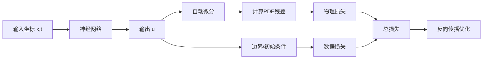

# PINN（物理信息神经网络）入门指南

## 目录
1. [什么是PINN](#什么是pinn)
2. [PINN的核心思想](#pinn的核心思想)
3. [学习路线](#学习路线)
4. [环境配置](#环境配置)
5. [第一个PINN示例](#第一个pinn示例)
6. [常用框架与工具](#常用框架与工具)
7. [学习资源](#学习资源)
8. [进阶方向](#进阶方向)

---

## 什么是PINN

**PINN (Physics-Informed Neural Networks)** 是一种将物理定律（如偏微分方程PDE）融入神经网络训练过程的深度学习方法。由Brown大学的Raissi等人于2019年提出。

### PINN的优势

| 特点 | 传统数值方法 | PINN |
|------|-------------|------|
| 网格依赖性 | 需要精细网格 | 无网格方法 |
| 高维问题 | 计算量爆炸 | 相对可行 |
| 逆问题求解 | 困难 | 天然支持 |
| 数据融合 | 困难 | 容易实现 |

---

## PINN的核心思想

PINN的核心在于构造一个**复合损失函数**：

```
Total Loss = Loss_data + λ × Loss_physics
```

### 损失函数组成

1. **数据损失 (Data Loss)**
   - 边界条件 (Boundary Conditions)
   - 初始条件 (Initial Conditions)
   - 观测数据 (Observed Data)

2. **物理损失 (Physics Loss)**
   - PDE残差 (PDE Residual)
   - 通过自动微分计算

### 工作流程



---

## 学习路线

### 阶段一：基础知识准备（1-2周）

- [ ] **Python编程基础**
- [ ] **深度学习基础**
  - 神经网络基本概念
  - 反向传播算法
  - 优化器（Adam, L-BFGS）
- [ ] **偏微分方程基础**
  - 热传导方程
  - 波动方程
  - Navier-Stokes方程

### 阶段二：PINN入门（2-3周）

- [ ] **阅读原论文**
  - Raissi et al., 2019: "Physics-informed neural networks"
- [ ] **实现简单案例**
  - 1D热传导方程
  - 1D Burgers方程
  - 2D Poisson方程

### 阶段三：进阶应用（持续学习）

- [ ] **复杂物理问题**
- [ ] **逆问题求解**
- [ ] **流体力学应用**
- [ ] **多物理场耦合**

---

## 环境配置

### 推荐环境

```bash
# 创建conda环境
conda create -n pinn python=3.9
conda activate pinn

# 安装PyTorch (根据你的GPU选择合适版本)
# CPU版本
pip install torch torchvision torchaudio

# CUDA版本（以CUDA 11.8为例）
pip install torch torchvision torchaudio --index-url https://download.pytorch.org/whl/cu118

# 安装其他依赖
pip install numpy matplotlib scipy
pip install deepxde  # 可选：流行的PINN框架
```

### 验证安装

```python
import torch
print(f"PyTorch版本: {torch.__version__}")
print(f"CUDA可用: {torch.cuda.is_available()}")
if torch.cuda.is_available():
    print(f"GPU设备: {torch.cuda.get_device_name(0)}")
```

---

## 第一个PINN示例

### 问题描述：1D热传导方程

求解一维热传导方程：

$$\frac{\partial u}{\partial t} = \alpha \frac{\partial^2 u}{\partial x^2}$$

边界条件：$u(0,t) = u(1,t) = 0$

初始条件：$u(x,0) = \sin(\pi x)$

### 代码实现

```python
import torch
import torch.nn as nn
import numpy as np
import matplotlib.pyplot as plt

# 设置随机种子
torch.manual_seed(42)
device = torch.device('cuda' if torch.cuda.is_available() else 'cpu')

# 定义神经网络
class PINN(nn.Module):
    def __init__(self, layers):
        super(PINN, self).__init__()
        self.layers = nn.ModuleList()
        for i in range(len(layers) - 1):
            self.layers.append(nn.Linear(layers[i], layers[i+1]))
        self.activation = nn.Tanh()
    
    def forward(self, x, t):
        inputs = torch.cat([x, t], dim=1)
        for i, layer in enumerate(self.layers[:-1]):
            inputs = self.activation(layer(inputs))
        return self.layers[-1](inputs)

# 物理参数
alpha = 0.01  # 热扩散系数

# 计算PDE残差
def physics_loss(model, x, t):
    x.requires_grad_(True)
    t.requires_grad_(True)
    
    u = model(x, t)
    
    # 计算偏导数
    u_t = torch.autograd.grad(u, t, grad_outputs=torch.ones_like(u),
                               create_graph=True)[0]
    u_x = torch.autograd.grad(u, x, grad_outputs=torch.ones_like(u),
                               create_graph=True)[0]
    u_xx = torch.autograd.grad(u_x, x, grad_outputs=torch.ones_like(u_x),
                                create_graph=True)[0]
    
    # PDE残差: u_t - alpha * u_xx = 0
    residual = u_t - alpha * u_xx
    return torch.mean(residual**2)

# 边界条件损失
def boundary_loss(model, t_bc):
    x_left = torch.zeros_like(t_bc)
    x_right = torch.ones_like(t_bc)
    
    u_left = model(x_left, t_bc)
    u_right = model(x_right, t_bc)
    
    return torch.mean(u_left**2) + torch.mean(u_right**2)

# 初始条件损失
def initial_loss(model, x_ic):
    t_ic = torch.zeros_like(x_ic)
    u_ic = model(x_ic, t_ic)
    u_exact = torch.sin(np.pi * x_ic)
    
    return torch.mean((u_ic - u_exact)**2)

# 训练配置
layers = [2, 32, 32, 32, 1]  # 网络结构
model = PINN(layers).to(device)
optimizer = torch.optim.Adam(model.parameters(), lr=1e-3)

# 采样点
N_pde = 10000
N_bc = 500
N_ic = 500

# 训练循环
epochs = 5000
for epoch in range(epochs):
    optimizer.zero_grad()
    
    # 采样
    x_pde = torch.rand(N_pde, 1).to(device)
    t_pde = torch.rand(N_pde, 1).to(device)
    t_bc = torch.rand(N_bc, 1).to(device)
    x_ic = torch.rand(N_ic, 1).to(device)
    
    # 计算损失
    loss_pde = physics_loss(model, x_pde, t_pde)
    loss_bc = boundary_loss(model, t_bc)
    loss_ic = initial_loss(model, x_ic)
    
    loss = loss_pde + 10*loss_bc + 10*loss_ic
    
    loss.backward()
    optimizer.step()
    
    if epoch % 500 == 0:
        print(f"Epoch {epoch}: Loss = {loss.item():.6f}")

print("训练完成！")
```

---

## 常用框架与工具

### 1. DeepXDE

最流行的PINN框架之一，支持多种后端。

```python
import deepxde as dde

# 定义几何域
geom = dde.geometry.Interval(0, 1)
timedomain = dde.geometry.TimeDomain(0, 1)
geomtime = dde.geometry.GeometryXTime(geom, timedomain)

# 定义PDE
def pde(x, y):
    dy_t = dde.grad.jacobian(y, x, i=0, j=1)
    dy_xx = dde.grad.hessian(y, x, i=0, j=0)
    return dy_t - 0.01 * dy_xx

# 创建数据和模型
data = dde.data.TimePDE(geomtime, pde, [], num_domain=10000)
net = dde.nn.FNN([2] + [32]*3 + [1], "tanh", "Glorot uniform")
model = dde.Model(data, net)
```

### 2. NVIDIA Modulus

NVIDIA推出的工业级PINN框架，适合大规模仿真。

### 3. SciANN

基于Keras的科学计算神经网络库。

### 4. PyTorch/TensorFlow

直接使用底层框架，灵活度最高。

---

## 学习资源

### 论文推荐

| 论文 | 描述 |
|------|------|
| Raissi et al. (2019) | PINN开山之作 |
| Lu et al. (2021) | DeepXDE框架论文 |
| Karniadakis et al. (2021) | PINN综述文章 |

### 在线课程

1. **YouTube**: Steve Brunton的PINN系列讲座
2. **Coursera**: 科学计算中的神经网络
3. **GitHub**: 各种PINN教程仓库

### 代码仓库

- [DeepXDE官方示例](https://github.com/lululxvi/deepxde)
- [PINN教程集合](https://github.com/maziarraissi/PINNs)
- [NVIDIA Modulus](https://github.com/NVIDIA/modulus)

---

## 进阶方向

### 1. 自适应采样策略
- Residual-based Adaptive Refinement (RAR)
- 重要性采样

### 2. 网络架构改进
- Fourier特征嵌入
- Modified MLP
- 多尺度网络

### 3. 训练技巧
- 学习率调度
- 损失权重自适应
- L-BFGS二阶优化

### 4. 应用领域
- **流体力学**: Navier-Stokes方程求解
- **固体力学**: 应力应变分析
- **传热学**: 复杂几何传热问题
- **电磁学**: Maxwell方程
- **化学工程**: 反应-扩散方程

---

## 下一步行动

1. ✅ 配置Python和PyTorch环境
2. ⬜ 运行上面的1D热传导示例
3. ⬜ 尝试修改参数观察结果变化
4. ⬜ 阅读DeepXDE教程
5. ⬜ 选择一个感兴趣的PDE问题进行实践

---

> **提示**: PINN的学习需要结合物理知识和深度学习技能。建议从简单的1D问题开始，逐步过渡到更复杂的2D/3D问题。

*文档创建日期: 2026年1月11日*
