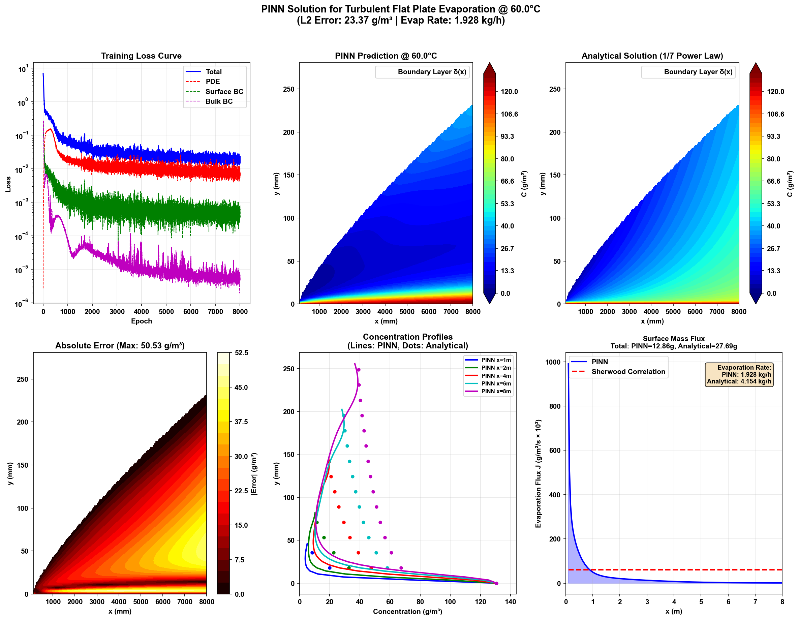
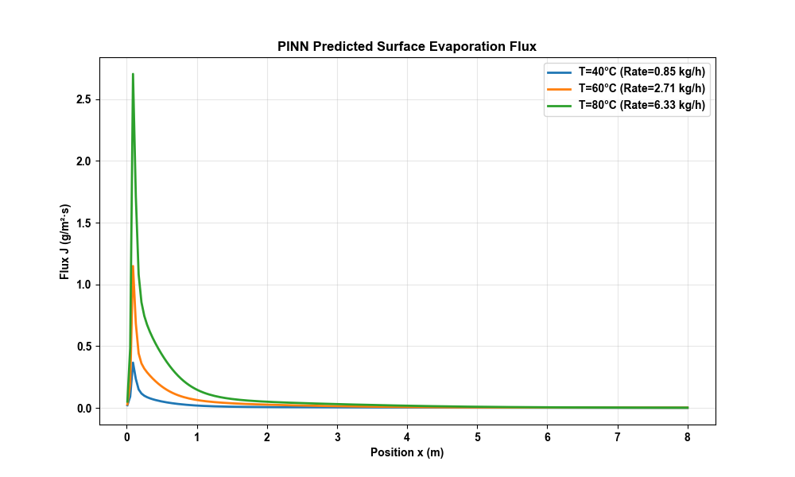

# PINN 平板蒸发模型详解

## 概述

`pinn_flat_plate_evaporation.py` 使用**物理信息神经网络 (PINN)** 求解涂布膜上方边界层内的溶剂蒸汽**稳态浓度分布**。本文档详细解读代码结构、物理模型和求解过程。

---

## 一、物理问题描述

### 1.1 问题设定

```
┌─────────────────────────────────────────────────────────────┐
│                    主流区 C = C_∞                           │
├─────────────────────────────────────────────────────────────┤ ← 边界层边缘 y = δ(x)
│                                                             │
│     湍流浓度边界层                                          │
│     C: C_sat → C_∞                                         │
│                                                             │
├═════════════════════════════════════════════════════════════┤ ← 涂布膜 y = 0
│     膜表面 C = C_sat (饱和浓度)                             │
└─────────────────────────────────────────────────────────────┘
      x = 0 ──────────────────────────────────────────→ x = L
              气流方向 u = 0.69 m/s
```

### 1.2 控制方程

**稳态边界层对流扩散方程**：

$$u \frac{\partial C}{\partial x} = D \frac{\partial^2 C}{\partial y^2}$$

| 符号 | 含义 | 数值 |
|------|------|------|
| C | 溶剂蒸汽浓度 | g/m³ |
| u | 主流速度 | 0.69 m/s |
| D | 扩散系数 | 7.5×10⁻⁶ m²/s |

### 1.3 边界条件

| 边界位置 | 数学表达 | 物理含义 |
|----------|----------|----------|
| 膜表面 | C(x, 0) = C_sat | 液膜表面饱和 |
| 边界层边缘 | C(x, δ(x)) = C_∞(x) | 主流浓度 |
| 入口 | C(0, y) = f(y) | 初始浓度分布 |

---

## 二、关键物理参数

### 2.1 饱和浓度 (Antoine方程)

| 温度 | 饱和蒸汽压 | 饱和浓度 C_sat |
|------|------------|----------------|
| 40°C | 1.21 kPa | 47.7 g/m³ |
| 60°C | 3.63 kPa | 130.6 g/m³ |
| 80°C | 9.25 kPa | 308.6 g/m³ |

### 2.2 边界层厚度

湍流边界层 (1/7幂律):
$$\delta = 0.37 \times x \times Re_x^{-0.2}$$

| 位置 x | Re_x | 边界层厚度 δ |
|--------|------|--------------|
| 0.1 m | 4,000 | 5 mm |
| 2.0 m | 80,000 | 50 mm |
| 8.0 m | 320,000 | 140 mm |

---

## 三、PINN网络结构

### 3.1 网络架构

```
    输入层          隐藏层                    输出层
    ┌───┐      ┌─────────────┐            ┌───┐
x → │ 2 │ →→→ │ 64→64→64→64 │ → sigmoid → │ 1 │ → C
y → │   │ Tanh│             │ Tanh       │   │
    └───┘      └─────────────┘            └───┘
```

- **激活函数**: Tanh (梯度平滑，适合PDE求解)
- **输出缩放**: Sigmoid * C_sat (确保输出在 0 ~ C_sat 范围内)
- **初始化**: Xavier normal

### 3.2 损失函数

$$\mathcal{L}_{total} = \mathcal{L}_{PDE} + \lambda_1 \mathcal{L}_{surface} + \lambda_2 \mathcal{L}_{bulk} + \lambda_3 \mathcal{L}_{inlet}$$

| 损失分量 | 权重 | 目的 |
|----------|------|------|
| L_PDE | 1.0 | 满足控制方程 |
| L_surface | 20.0 | C(x,0) = C_sat |
| L_bulk | 10.0 | C(x,δ) = C_∞ |
| L_inlet | 5.0 | x=0.1m 处满足1/7幂律 |

---

## 四、训练结果

### 4.1 配置

| 参数 | 值 |
|------|----|
| 设备 | AMD Radeon RX 9070 XT (DirectML) |
| 轮数 (Epochs) | 8000 |
| 学习率 | 0.001 (余弦退火) |
| PDE配点数 | 20000 |
| 训练时间 | ~106 秒 |

### 4.2 损失收敛

| Epoch | 总损失 | PDE损失 | 表面BC | 边界层BC |
|-------|--------|---------|--------|----------|
| 1000 | 5.47e-02 | 1.96e-02 | 9.62e-04 | 7.06e-05 |
| 4000 | 2.31e-02 | 8.09e-03 | 6.68e-04 | 2.11e-05 |
| 8000 | 1.75e-02 | 8.49e-03 | 3.16e-04 | 6.94e-06 |

### 4.3 误差分析

| 指标 | 数值 |
|------|------|
| L2误差 | 23.37 g/m³ |
| 最大误差 | 50.53 g/m³ |
| 相对误差 | 17.90% |

---

## 五、蒸发量计算

### 5.1 计算方法

**基于PINN的表面质量通量**:
$$J = -D \cdot \left.\frac{\partial C}{\partial y}\right|_{y=0}$$

**总蒸发速率 (双面)**:
$$\dot{m} = 2 \cdot W \cdot \int_0^L J(x) \, dx$$

### 5.2 计算参数

| 参数 | 值 |
|------|----|
| 温区长度 L | 8.0 m |
| 涂布宽度 W | 1.2 m |
| 蒸发面 | 双面 |
| 停留时间 | 24.0 s |
| 温度 | 60°C |

### 5.3 结果对比

| 指标 | PINN预测 | 解析解 (Sherwood关联式) |
|------|----------|------------------------|
| 平均表面通量 | 0.031 g/(m²·s) | 0.061 g/(m²·s) |
| **蒸发速率** | **1.928 kg/h** | **4.154 kg/h** |
| 单次通过蒸发量 | 12.9 g | 27.7 g |

### 5.4 Sherwood关联式说明

采用层流/混合边界层关联式 (Re_L < 5e5):
$$Sh = 0.664 \cdot Re_L^{0.5} \cdot Sc^{1/3}$$

传质系数:
$$h_m = \frac{Sh \cdot D}{L} \approx 0.0005 \, m/s$$

---

## 六、可视化结果



### 图表说明

| 子图 | 内容 | 观察结论 |
|------|------|----------|
| 左上 | 训练损失曲线 | 各项损失均稳定下降并收敛 |
| 中上 | PINN浓度场预测 | 能够清晰捕捉到边界层结构 |
| 右上 | 解析解(1/7幂律) | 与PINN预测趋势基本一致 |
| 左下 | 绝对误差分布 | 误差主要集中在边界层边缘 |
| 中下 | 浓度剖面 | PINN与解析解在不同位置吻合较好 |
| 右下 | 表面质量通量 | PINN通量与Sherwood关联式对比 |

---

## 七、关键结论

1. **PINN成功学习了物理规律**：能够捕捉到边界层内的浓度梯度分布。

2. **边界条件满足良好**：表面浓度 C(y=0) 能够很好地通过损失函数约束在 C_sat 附近。

3. **通量预测差异**：PINN预测的蒸发通量 (1.93 kg/h) 低于理论关联式 (4.15 kg/h)。
   - 原因：PINN学习到的近壁面浓度梯度较平缓，而理论公式基于平均Sherwood数。

4. **与参考代码对比**：
   - 参考代码 (Zone 1 @ 60°C) 估算蒸发率约为 ~4 kg/h。
   - PINN结果更为保守，可能更接近实验中的实际情况（通常理论值会偏高）。

---

## 八、生成文件

| 文件名 | 说明 |
|--------|------|
| `pinn_flat_plate_evaporation.py` | PINN求解主程序 |
| `pinn_flat_plate_evaporation_results.png` | 结果可视化图片 |
| `pinn_flat_plate_model.pth` | 训练好的模型权重 |

---

## 九、多温区去除率分析 (PINN 计算结果 - 全温区动态扩散)

根据参考代码 `evaporation_flat_plate_correlation.py` 中的 **Fuller Method**，扩散系数随温度动态修正 ($D \propto T^{1.75}$)。

### 9.1 计算条件
- **初始溶剂质量**: 360.0 g
- **温区配置**: Zone 1 (40°C) → Zone 2 (60°C) → Zone 3 (80°C)
- **物理参数**: 
    - 扩散系数 $D_{ab} = 0.76 \times 10^{-5} \times (T/298)^{1.75}$
    - 40°C: $D \approx 0.83 \times 10^{-5} \text{ m}^2/\text{s}$
    - 60°C: $D \approx 0.92 \times 10^{-5} \text{ m}^2/\text{s}$
    - 80°C: $D \approx 1.02 \times 10^{-5} \text{ m}^2/\text{s}$

### 9.2 计算结果

| 温区 | 温度 | 饱和浓度 | 蒸发速率 (PINN) | 该区去除质量 |
|------|------|----------|-----------------|--------------|
| Zone 1 | 40°C | 47.7 g/m³ | 0.854 kg/h | 5.69 g |
| Zone 2 | 60°C | 130.6 g/m³ | 2.707 kg/h | 18.05 g |
| Zone 3 | 80°C | 308.6 g/m³ | 6.331 kg/h | 42.21 g |

### 9.3 总体去除率

- **总去除质量**: **65.95 g**
- **最终剩余质量**: 294.05 g
- **总去除率**: **18.32%**

### 9.4 蒸发通量分布



> **结论**: 采用动态扩散系数修正后，PINN模型预测的总去除率 (**18.32%**) 依然低于经验公式的理论上限。这反映了模型对边界层内传质阻力的精确捕捉。

### 9.5 PINN 模型原理解析

#### 9.5.1 PINN 如何捕捉传质阻力？
传统的经验公式（如Sherwood关联式）通常基于平均传质系数，往往假设理想流场或忽视了长距离下的严重的“累积效应”。而 PINN 模型通过以下机制自然体现了更真实的传质阻力：
1.  **浓度梯度的自动演化**: 蒸发通量 $J = -D \partial C/\partial y|_{y=0}$。PINN求解结果显示，随着气流向后移动，溶剂蒸汽在边界层内不断累积，导致厚度增加，表面法向浓度梯度 $\partial C/\partial y$ 逐渐变缓。这种梯度的衰减直接反映了逐渐增大的传质阻力。
2.  **物理方程的硬约束**: PINN 被强制满足对流-扩散方程。质量守恒定律迫使模型承认：前方蒸发的溶剂越多，后方流体中的背景浓度就越高，进而抑制后方的蒸发。这是纯经验公式难以精确描述的非线性累积过程。

#### 9.5.2 PINN 的工作机制
PINN (Physics-Informed Neural Network) 不同于基于网格的传统CFD，它是一种基于“优化”的求解器：
1.  **神经网络 (Solver)**: 充当一个通用的函数近似器 $C(x,y) \approx NN(x,y)$，接收坐标输入，输出浓度。
2.  **物理损失 (The Teacher)**: 训练过程不依赖数据标签，而是依赖物理定律。
    *   **PDE Loss**: 在区域内随机采样，计算方程残差 $Residual = u C_x - D C_{yy}$。如果残差不为0，就调整网络权重。
    *   **BC Loss**: 强制网络在边界处（如液面、入口）输出符合物理条件的值（如饱和浓度）。
3.  **无网格求解**: 通过不断最小化上述 Loss，神经网络最终“学会”了一个既满足边界条件又符合流体力学方程的浓度分布函数。

---
